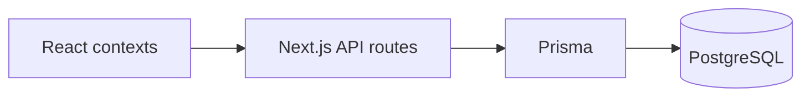

# PostgreSQL Migration — Removed localStorage Fallbacks

Business modules now require PostgreSQL via the API. When the database is unavailable, contexts expose `loadError` and mutations log explicit errors instead of silently persisting to `localStorage`.

## New API-only helpers

| File | Purpose |
|------|---------|
| `lib/data-source/errors.ts` | `DataSourceUnavailableError` and message helper |
| `lib/data-source/context-api.ts` | `loadFromApi()`, `runOnApi()`, `assertRemoteDataSourceAvailable()` |

Legacy `loadRemoteOrLocal()` / `runRemoteOrLocal()` helpers were **fully removed**. All business contexts use `loadFromApi()` / `runOnApi()` from `lib/data-source/context-api.ts`.

## Authority model (current)

| Domain | Source of truth | Notes |
|--------|-----------------|-------|
| Business records | PostgreSQL via API | Sales, expenses, purchases, staff payments, daily operations, stock |
| Day open/close | PostgreSQL `DayClosing` via `/api/day-closings` | In-memory cache in `lib/day-closing/storage.ts` is **not** authoritative |
| Staff people | PostgreSQL via `/api/staff` | `DEFAULT_STAFF_ROLES` is role configuration only — not staff records |
| Branch selection (owner) | Server session + PostgreSQL branch ownership via `context/branch-context.tsx` | Frontend branch state alone is not sufficient for security; staff users are limited to assigned branch |
| Reports UI (`/reports`) | Aggregates **API-loaded** daily operations in the browser | Data originates from PostgreSQL; `/api/reports/summary` provides server-side aggregation for API consumers |
| Auth session | Signed httpOnly cookie | Legacy `sonic-os-staff` localStorage key is purged on logout — not read as staff authority |

## Removed localStorage read/write functions

| Module | Storage file | Removed functions | localStorage key (no longer written) |
|--------|--------------|-------------------|--------------------------------------|
| Daily Operations | `lib/storage.ts` | `getEntries()`, `saveEntries()` | `STORAGE_KEY` |
| Sales | `lib/sales-storage.ts` | `getSales()`, `saveSales()` | `SALES_STORAGE_KEY` |
| Customers | `lib/sales-storage.ts` | `getCustomers()`, `saveCustomers()` | `SALES_CUSTOMERS_STORAGE_KEY` |
| Purchases | `lib/purchasing-storage.ts` | `getPurchases()`, `savePurchases()` | `PURCHASING_PURCHASES_STORAGE_KEY` |
| Suppliers | `lib/purchasing-storage.ts` | `getSuppliers()`, `saveSuppliers()` | `PURCHASING_SUPPLIERS_STORAGE_KEY` |
| Stock products | `lib/stock-storage.ts` | `getStockProducts()`, `saveStockProducts()` | `STOCK_PRODUCTS_STORAGE_KEY` |
| Stock movements | `lib/stock-storage.ts` | `getStockMovements()`, `saveStockMovements()` | `STOCK_MOVEMENTS_STORAGE_KEY` |
| Stock price changes | `lib/stock-storage.ts` | `getStockPriceChanges()`, `saveStockPriceChanges()` | `STOCK_PRICE_CHANGES_STORAGE_KEY` |
| Expenses | `lib/expenses-module-storage.ts` | `getExpenseRecords()`, `saveExpenseRecords()` | `EXPENSES_RECORDS_STORAGE_KEY` |
| Expense categories | `lib/expenses-module-storage.ts` | `getExpenseCategories()`, `saveExpenseCategories()` | `EXPENSES_CATEGORIES_STORAGE_KEY` |
| Staff payments | `lib/staff-payments/storage.ts` | `getStaffPayments()`, `saveStaffPayments()` | `STAFF_PAYMENTS_STORAGE_KEY` |

Normalize/sort helpers in those files are unchanged.

## Context changes (fallback paths removed)

### `context/entries-context.tsx` — Daily Operations

- **Load:** `loadRemoteOrLocal({ remote: fetchDailyOperations, local: getEntries })` → `loadFromApi(fetchDailyOperations)`
- **Upsert:** removed `saveEntries()` local branch
- **Delete / import / bulk delete:** removed `saveEntries()` local branches
- Initial state: `[]` instead of `getEntries()`

### `context/sales-context.tsx` — Sales + Customers

- **Load:** removed local `{ sales: getSales(), customers: getCustomers() }`
- **CRUD:** removed `persistSales()` / `persistCustomers()` → `saveSales()` / `saveCustomers()`
- **`completeSale` local path:** removed `recordMovement()` + `persistSales()`; server transaction handles stock + sale row
- Initial state: `[]` instead of `getSales()` / `getCustomers()`

### `context/purchasing-context.tsx` — Purchases + Suppliers

- **Load:** removed local `getPurchases()` / `getSuppliers()`
- **Supplier CRUD:** removed local persist + audit-only paths
- **`completePurchase` local path:** removed manual stock snapshot/restore, `recordMovement()`, `updateProduct()`, `persistPurchases()`
- Initial state: `[]`

### `context/stock-context.tsx` — Stock

- **Load:** removed local `getStockProducts()` / `getStockMovements()` / `getStockPriceChanges()`
- **Product CRUD / movements:** removed all `saveStock*` local branches
- Removed `getStockSnapshot()` / `restoreStockSnapshot()` (only used by removed purchase local fallback)
- Initial state: `[]`

### `context/expenses-module-context.tsx` — Expenses

- **Load:** removed `getExpenseCategories()` / `getExpenseRecords()` local branches
- **CRUD:** removed `saveExpenseRecords()` / `saveExpenseCategories()` via `persist*`
- **`upsertStaffPaymentExpense`:** no longer writes to localStorage; returns error directing users to Staff Payments API
- **`linkLegacyStaffPaymentExpenses`:** no-op (legacy localStorage linking removed)
- Initial state: `[]`

### `context/staff-payments-context.tsx` — Staff Payments

- **Load:** removed `getStaffPayments()` + `migrateLegacyStaffPaymentExpenses()` local migration
- **`recordStaffPayment` local path:** removed `upsertStaffPaymentExpense()` + `saveStaffPayments()`
- Removed dependency on expenses context for initial load
- Initial state: `[]`

## Related fixes

### `context/staff-context.tsx`

- Removed `isStaffReferenced()` that read sales/purchases/expenses/entries from localStorage
- Staff delete reference checks are enforced server-side in `lib/server/services/staff-service.ts` (`assertStaffNotReferenced`)

### `context/day-closing-context.tsx`

- **`closeDay`:** uses `entries` from `EntriesContext` instead of `getEntries()` from localStorage when upserting the completed daily operation

## Data flow after migration

## Verification

### Sale → Prisma `Sale` table

1. Ensure `NEXT_PUBLIC_USE_API=true` and PostgreSQL is running (`/api/health` reports `databaseConnected: true`).
2. Complete a sale in the UI.
3. `POST /api/sales` calls `createSale()` in `lib/server/services/sales-service.ts`, which inserts into `prisma.sale` inside a transaction (with stock movement).

### Page refresh loads from PostgreSQL

1. After creating a sale, refresh the page.
2. `SalesProvider` calls `loadFromApi` → `GET /api/sales` → `listSales()` → `prisma.sale.findMany()`.
3. The same sale appears because it is loaded from PostgreSQL, not localStorage.

### Database unavailable

1. Stop PostgreSQL or misconfigure `DATABASE_URL`.
2. Business contexts set `loadError` to e.g. *"PostgreSQL is unavailable. Business data cannot be loaded or saved."*
3. Mutations log the same error; no silent localStorage writes occur.

## localStorage retained (non-authoritative UX only)

These keys may exist for UX convenience or legacy purge targets. They are **not** sources of truth for business records:

- Active branch preference (`ACTIVE_BRANCH_STORAGE_KEY`)
- Stock movement branch UX keys
- Notifications (`NOTIFICATIONS_STORAGE_KEY`)
- Historical import undo snapshot (`IMPORT_UNDO_STORAGE_KEY`)
- Legacy keys purged on logout via `lib/auth-storage.ts` (`clearSession`) — including `sonic-os-staff`, `sonic-os-entries`, `sonic-os-sales`, etc.

Settings, branches, expense templates, audit log, and day closings load from PostgreSQL via API contexts.

## Day closing (current)

- **Load/save:** `DayClosingProvider` → `fetchDayClosings()` / `closeDayApi()` → PostgreSQL
- **Cache:** `lib/day-closing/storage.ts` holds an in-memory process cache synchronized from API responses — not localStorage, not authoritative
- **Close flow:** staff payouts are recorded via Staff Payments API **before** `closeDayApi()`; server performs the authoritative close

## Environment

- `NEXT_PUBLIC_USE_API=true` — required for business data
- Valid `DATABASE_URL` — PostgreSQL must be reachable for load/save operations
